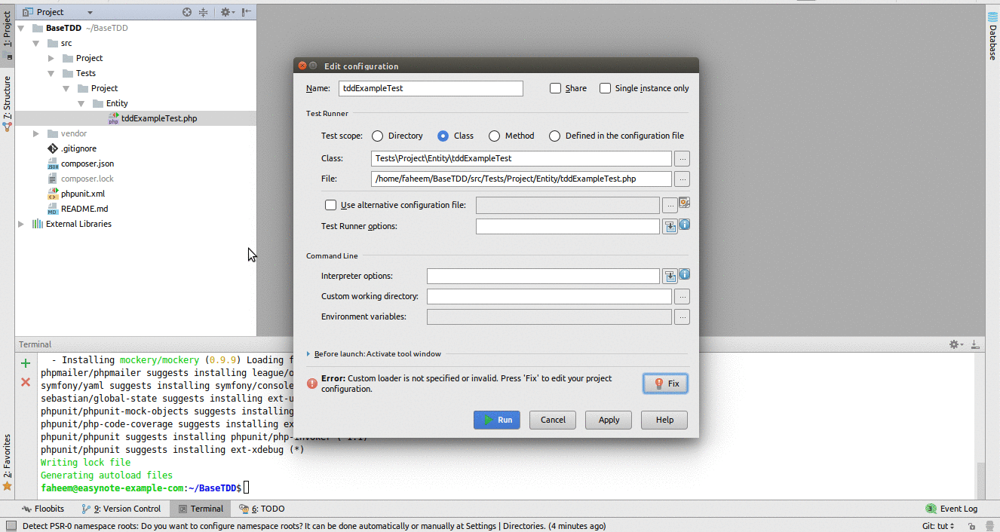
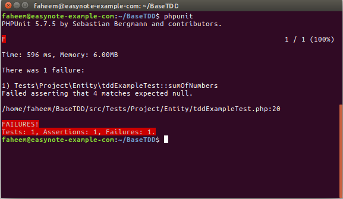

# BaseTDD
### Test Driven Development
#### In test-driven development, each new feature begins with writing a test.

## Why?
    * To write fully testable code
    * Avoid unwanted behaviour when changing code.
    * Easier to refactor.
    
### Before we start:

* Fork this repo and clone it to local.
* Basic knowledge of PHP OOP is a must.
* Having PHPStorm IDE will be a bonus.

## Set up:
* Install [PHPUnit](https://phpunit.de/getting-started.html)
* Composer Install in root folder.

### Looking at the test file:

Open the file `src/Tests/Project/Entity/tddExampleTest.php`.
You will find the following method in the class tddExampleTest.

    `/**
    *@test
    */
    public function sumOfNumbers()
    {
    $Class = new tddExample();
    $this->assertEquals($Class->addition(2,2),4);
    }`

The above method is a simple test of method addition() in the class ttdExample. 
You can find tddExample class in the file `src/Project/Entity/tddExample.php`

## Testing:
Now to test if it is failing:
### PHPStorm
    1. Right click `/src/Tests` folder.
    2. Click run 'Tests'.
    3. In edit configuration click on the button Fix.
    4. Add the full path to `vendor/autoload.php` in Path to script.
    5. You will now be able to run your test.
    6. In future, click the green run/play button to run tests. 
    

### OR

### Command Line
`Run the command phpunit in the root of the repository.`

The test should be failing as seen in the graphic examples above.

## Passing the test.

### Assertions
In `src/Tests/Project/Entity/tddExampleTest.php` :

`$this->assertEquals($Class->addition(2,2),4);`
___

The above method call makes an assertion that the two given arguments are __EQUAL__ to each other.
You can pass this assertion by changing the it too:

`$this->assertEquals(4,4);`

If you run your test you will see that the test has passed.
___

Now change it to: `$this->assertEquals(3,4);`

The test will now fail.
___
However the point of TDD is to make sure all methods that will be used in code are testable.

Change this line of code back to: `$this->assertEquals($Class->addition(2,2),4);`

## Making the test past in the easiest possible way.

___Being the evil programmer__

Whenever attempting to make a test pass, try do so in the most convenient way as possible.
In this case the easiest way possible to pass the test `public function sumOfNumbers()` is to return the number four in the method it is testing i.e  `addition()` in the class `tddExample` in the folder `src/Project/Entity/tddExample.php`. This is referred to being the evil programmer: using as little energy and passing the test as ___lazily___ as possible.

 `function addition()
 {
    return 4;
 }`

Run phpunit in terminal or click the run button in PhpStorm.
You will see that the test are passing.

However this function will not be accurate if the numbers 3 and 5 are passed into it.

For this we create another test for it.

In `src/Tests/Project/Entity/tddExampleTest.php` :

Create a new test.

     /**
     * @test
     */
    public function sumOfNumbersThreeAndFive()
    {
      $Class = new tddExample();
      $this->assertEquals($Class->addition(3,5) , 8);
    }

If you run your test you will see that a test has failed. You will get a message simalar to this:

___Failed asserting that 8 matches expected 4.___

In PhpStorm you can actually click on  `<Click to see difference>` and view the expected result and the actual result.

## Doing the work

So we have come to the point where the simplest possible is actually to return the sum of the two numbers:

/**`function addition($firstNumber, $secondNumber)
 {
    return $firstNumber + $secondNumber;
 }`**/
